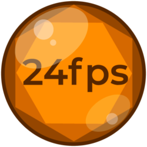

# mcpro24fps Logo Animation

Watch it on YouTube:

This is my original animation for the [mcpro24fps app](https://www.mcpro24fps.com/) logo.

* By: Paulo José <pauloup@gmail.com>
* Date: 2021.05.30
* Version: v.0.1
* Software: Blender 2.92
* mcpro24fps logo by: Александр Трофимов <mcpro24fps@gmail.com>
* Source: http://github.com/pauloup/mcpro24fps-logo-anim

## Download

### Release Package Download

* Download link: <https://yadi.sk/d/1G6F2j9Tvxz38w>

The Release Package has the same animation in different formats. The full package is huge (20GB) because it includes EXR files (16GB). But you don't usually need them. The PNG files are enough in most cases. They are much smaller and easier to work with.

For instance, to add the animation on 1080p 30fps projects, just download the `PNG-1080p/30fps` folder (only 111MB).
The next section may help choosing the right format.

Don't forget downloading the `audio.flac` and `README.md` files.

### What's in the package
There are 4 main formats:

* `EXR-4K`: Full quality 4K in 32 bit color depth EXR images, the native format for Blender renders;
* `PNG-4K`, `PNG-1080p`, and `PNG-720p`: High quality 4K, 1080p and 720p PNG images in 8 bit color depth.

Each format has 5 sub-formats:

* `24fps`, `25fps`, `30fps`, and `60fps`: Landscape 16:9 aspect ratio;
* `30fps-Vertical`: Portrait 9:16 aspect ratio, for uses like Instagram Stories.

In total, the Release Package has 20 different image formats, plus 1 audio file in FLAC 24bit.
See more details in [Release Package Structure](#release-package-structure).

### How to use the package

* Download the format folder that better suits your needs.
* Also download `audio.flac` and `README.md` files.
* Import the image files as an image sequence in the Video Editor of your choice.
* Import the `audio.flac` file, and sync it to the image sequence.
* Note that the video duration is 4 seconds, while the audio is 5 seconds.
* Please extend the last frame for at least 1 second to avoid cutting the audio.
* If you used the audio, see Licensing in `README.md` before publishing your video.

### Examples on YouTube

* 4K 24fps 16:9 <https://youtu.be/VZS1kBaWiDg>
* 4K 30fps 9:16 <https://youtu.be/2Mhl5v1P68c>

### Blender Project Download
To get the Blender project, just download or clone this repository:

    git clone https://github.com/pauloup/mcpro24fps-logo-anim.git

If you're reading this from other sources, get it on <http://github.com/pauloup/mcpro24fps-logo-anim>.

## About

This animation was done as a personal project, since I really like the mcpro24fps logo and using the app. After finishing the initial version, I contacted the app developer, asked him to watch and approve it. He liked it, and asked me to make it free for public use, what was my original intent actually. So here you have it.

## Licensing

### Blender Project License

* [CC0 1.0 Universal (CC0 1.0) Public Domain Dedication](https://creativecommons.org/publicdomain/zero/1.0/legalcode.txt)

### Release Package License

* Image: [CC0 1.0 Universal (CC0 1.0) Public Domain Dedication](https://creativecommons.org/publicdomain/zero/1.0/legalcode.txt)
* Audio: [Attribution-NonCommercial 4.0 International (CC-BY-NC 4.0)](https://creativecommons.org/licenses/by-nc/4.0/legalcode.txt)

The Blender project and the Release Package's Image are Public Domain, including the EXR/PNG exported files. Feel free to use, remix, transform, and build upon the animation. You're not required to credit me, but if you wish to, you may say:

    mcpro24fps logo by Александр Трофимов and its animation by Paulo José.

More about the CC0 license: <https://creativecommons.org/publicdomain/zero/1.0/>.

Release Package's Audio has a more restricted licence (CC-BY-NC) because I'm not a sound designer, and had to use sample sounds from others. The final mix is still free to use, you just have to credit authors, and use it only for non-commercial purposes. See below [how to credit audio](#how-to-credit-audio), it's easy.

### How to credit audio
The simpler way to credit the sounds authors is to include:

    This video uses sounds from freesound, see the full list here:
    http://github.com/pauloup/mcpro24fps-logo-anim#full-list-of-sounds

### Combined License
The Image and Audio are licensed separately, so the Image can keep its CC0 license. But when they are used together, the resulting video will be under the CC-BY-NC license. Unfortunately, it's not possible to include the Audio in a work with a more permissive license. So the same tip in [How to credit audio](#how-to-credit-audio) applies here.

## Rendering

To render the animation yourself, you need first to download or clone this repository to get all needed files. If you're reading this from other sources, get it on <http://github.com/pauloup/mcpro24fps-logo-anim>.

## Requirements

* Blender 2.92 or above. Get it on [blender.org](https://www.blender.org/download/).
* A good processor/graphics card to render noise-free 4K frames in Blender Cycles.

## How to render
Open the file `mcpro24fps-logo-anim-by-pauloup.blend` in Blender.
Hit `Render Animation` to render a 4K 24fps version of the animation in EXR file format.
To do it faster, you may use the command line instead:

    path-to/blender -b path-to/mcpro24fps-logo-anim-by-pauloup.blend -a

To render at 25, 30 or 60fps, change the active scene to one of the `EXR-4K-*` scenes, save the file and render it with the same command.
You can also set the active scene and render it using just the command line:

    path-to/blender -b path-to/mcpro24fps-logo-anim-by-pauloup.blend -S EXR-4K-30fps -a
	
Where `EXR-4K-30fps` is the scene to render.

### Render time
Each frame takes about 30 minutes to render on my old GT 730 nVidia graphics card, at least until frame 32. After that the logo will shrink in size, and it will get much faster to render.

### PNG versions
After rendering, you can export PNG versions in 4K, 1080p and 720p resolutions. PNG has better compatibility with older and simpler video editors, and PNG files are much smaller. Use the scene `PNG-Export`, and follow the instructions in the Compositor screen.

Note: After rendering the `PNG-Export` scene, an `empty.mkv` file will be created. This scene have no main output, because it uses File Output nodes in the Compositor to export files. But Blender has a limitation to always output a file from the Composite node. *You can safelly delete it*.

### Other framerates
To render new framerates, duplicate the `EXR-4K-24fps` scene using the option `Linked Copy`. Rename it accordingly, and use option `Time Remapping` in `Output Properties`. Let `Old` as `24`, and set `New` as the new framerate. Don't forget to change the `Output Path` to reflect the new framerate. For instance, set `//release\EXR-4K\120fps\` for 120fps. The Compositor nodes on the `PNG-Export` scene should also be edited to include the new framerates, if you want to export it in PNG after rendering.

### Story format
There's a vertical/portrait version in the `EXR-4K-30fps-Vertical` scene to use in formats like Instagram Stories.

Watch an example on YouTube:

## Animation script

I imagined the mcpro24fps logo as two sets of lens aperture blades, with the text between them, all that inside a circular glass, as a lens. The animation starts empty, then the foreground blades close very near the camera. Right after that, they open again, revealing a big 24fps text, and the background blades behind it also start opening, while the camera zooms in slowly. Before the background blades could finish opening, the camera abruptly zooms out, revealing a circular frame that limits the logo, and a pair of lens flares shine over it in a slow rotation. The camera stops moving smoothly, but the strong movement keeps the blades moving, until everything stops. The full animation takes 4 seconds. As the sound effects last for 5 seconds, the last frame should be extended as needed, for a least 1 second.

## How it's done

The animation is done in the `EXR-4K-24fps` scene, with all other `EXR-4K-` scenes just linking the same data. There are 2 View Layers, `Logo` and `Flare`, and they are combined in the Compositor. The `Logo` layer has most of the objects, like the blades and text, as well as a big black square with a hole in the middle, with a Holdout material to hide the blades parts that go outside the logo, from the camera view. The `Flare` layer has circles simulating the flares, and a Compositor node Add makes them translucent over the `Logo` layer. Gamma correction nodes are also used to properly reproduce the original color blending. The blades opening and closing animations are done using Constraints, controlled by the `Blades-B-Control` and `Blades-F-Control` objects. The animation starts with semi photorealist materials, and then fades to solid emitters with no shadow, during the fast camera zoom-out.

## Reference image

The original mcpro24fps logo is not my creation. This image is included only for reference purposes, and it's not used to render the frames. No other image was used in this project. For further info about the logo, please contact the mcpro24fps developer.

## Font Montserrat Semibold

* Authors: Julieta Ulanovsky, Sol Matas, Juan Pablo del Peral, Jacques Le Bailly
* Source: <https://fonts.google.com/specimen/Montserrat>
* License: SIL Open Font License 1.1 (OFL 1.1)

## Sound effects

Some free sounds are used for sound effects. Their licenses are presented below, and go from Public Domain to CC-BY-NC. Because of this, the resulting license for the final mix is CC-BY-NC. So to use audio, make sure to credit the authors, and that your work is not for commercial purposes. See [How to credit audio](#how-to-credit-audio).

Otherwise, you should use your own sound effects.

The pre-rendered final mix is included in `\\release/audio.flac`. To edit it, select the scene `Audio` and the Video Editor screen, make your changes, and use the option `Render Audio...` to export to `\\release/audio.flac`, and overwrite it.

### Full list of sounds

* ID: 33523
    * Title: Boom goes the bassdrum » Big boom.wav
    * Source: <https://freesound.org/people/jobro/sounds/33523/>
    * License: CC-BY
    * Author: jobro

* ID: 65913
    * Title: reverse-tinkle-smash-glass.wav
    * Source: <https://freesound.org/people/BristolStories/sounds/65913/>
    * License: CC-BY-NC
    * Author: BristolStories

* ID: 167843
    * Title: Transition Whoosh 1a.wav
    * Source: <https://freesound.org/people/Speedenza/sounds/167843/>
    * License: CC-BY-NC
    * Author: Speedenza

* ID: 241146
    * Title: Transition » Transition Whoosh 5a
    * Source: <https://freesound.org/people/Speedenza/sounds/241146/>
    * License: CC-BY-NC
    * Author: Speedenza

* ID: 326721
    * Title: analogue_camera .wav
    * Source: <https://freesound.org/people/RynoStols/sounds/326721/>
    * License: CC-BY-NC
    * Author: RynoStols

* ID: 447807
    * Title: Wooshes » swosh.wav
    * Source: <https://freesound.org/people/florianreichelt/sounds/447807/>
    * License: CC0 Public Domain
    * Author: florianreichelt

* ID: 555109
    * Title: Paper Fan Open-Close
    * Source: <https://freesound.org/people/wolfdoctor/sounds/555109/>
    * License: CC0 Public Domain
    * Author: wolfdoctor

## Release Package Structure

    \\release
        \EXR-4K
            \24fps
            \25fps
            \30fps
            \30fps-vertical
            \60fps
        Format: EXR, RGBA linear 32-bit float
        Description: Full renders at 4K resolution and maximum quality.
        Scenes: EXR-4K-...
           
        \PNG-4K     \PNG-1080p     \PNG-720p
            \24fps
            \25fps
            \30fps
            \30fps-vertical
             \60fps
        Format: PNG, RGBA sRGB 8-bit
        Description: Production files at 4K, 1080p and 720p.
        Scene: PNG-Export
        
        \audio.flac
        Format: FLAC, 44.1kHz 24-bit
        Description: Mixed audio for sound effects.
        Scene: Audio
        
        \README.md
        Format: Markdown text
        Description: Required licensing information.
